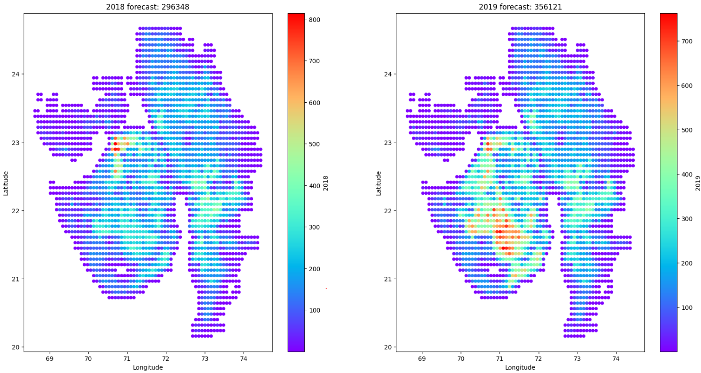
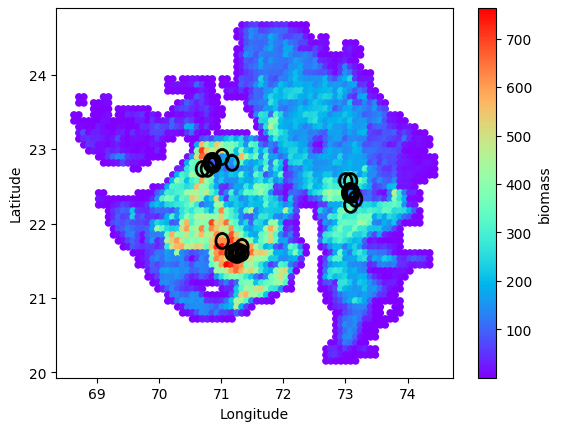

# **Optimize_biomass_supply_chain_through_AI-driven_forecasting_and_location-based_depot_optimization**

# 🌿 GreenHarvest: AI-Powered Biomass Supply Chain Optimizer 🚚

## Igniting Sustainable Energy with Data Science

Welcome to GreenHarvest, our groundbreaking solution for the Sparkathon Hackathon 2024 by WALMART! We're revolutionizing the biomass supply chain using cutting-edge AI and optimization techniques.

### 🚀 Getting Started

Embark on your GreenHarvest journey with these simple steps:

1. Fuel up your environment:
   ```bash
   pip install -r requirements.txt
   ```
2. Set your notebook's kernel to the right cosmic frequency (environment).

### 🔮 Forecasting the Future of Biomass

Dive into the [**crystal_ball.ipynb**](notebooks/crystal_ball.ipynb) notebook to uncover our biomass forecasting magic.

#### 🧹 Data Cleanup Ritual
We perform a sacred cleansing ceremony on our biomass dataset, banishing duplicates and filling voids in the pre-2014 census era.

#### 🧠 Neural Clustering
Our AI shaman groups districts based on their biomass auras, using the ancient art of Pearson correlation.

#### 🌾 Crop Prophecy Table
We conjure a mystical table of crop production, drawing wisdom from the [Desagri oracle](https://data.desagri.gov.in/website/crops-report-major-contributing-district-web).

#### 🗺️ Elevating Our Vision
We summon crop land spirits from [EarthStat](http://www.earthstat.org/) and elevation deities from [NASA's NEO realm](https://neo.gsfc.nasa.gov/dataset_index.php#energy).

#### 🤖 Training Our Bio-Oracle
Our model, a fusion of MaxAbsScaler and ExtraTreeRegressor, gazes into the past to predict the future. Behold its prophetic powers:

| Year | Prophecy Accuracy (MAE) |
|------|-------------------------|
| 2010 | 22.6                    |
| ...  | ...                     |
| Avg  | 25.9                    |

#### 🔮 Peering into 2018 and 2019
Our Bio-Oracle extends its vision to the near future, laying the groundwork for our optimization quest.



### 🏭 Optimizing the Harvest Network

Witness the birth of our optimal harvest network in the [**harvest_optimizer.ipynb**](notebooks/harvest_optimizer.ipynb) notebook.

#### 🏢 Refinery Constellation
We strategically place refineries to capture 80% of the biomass bounty, guided by the stars of our main biomass clusters.

#### 🚚 Depot Placement Ritual
Through an iterative dance of placement and removal, we find the perfect harmony of depot locations.

#### 🔧 Fine-Tuning Our Network
Our greedy algorithm polishes the network, seeking the perfect balance of efficiency and cost.

#### 🌍 The Optimized Harvest Network (2019 Edition)
Behold, the fruits of our labor:



Join us in revolutionizing sustainable energy with GreenHarvest! May your code be bug-free and your optimizations be plentiful. 🌟
